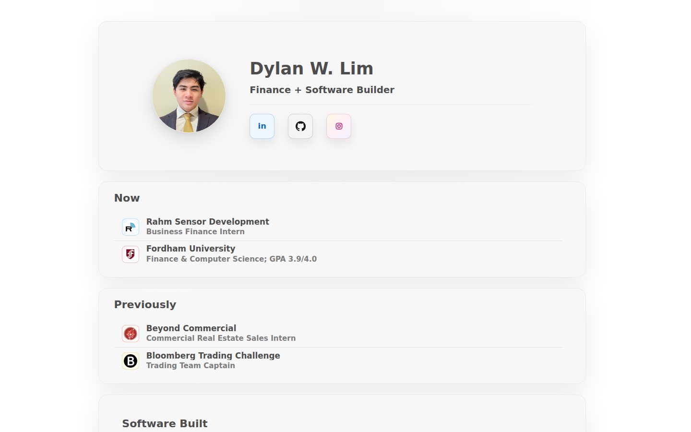

# Dylan W. Lim Portfolio Site

  

<strong>Proof-driven portfolio site for finance, software, healthcare access, local-first tools, and operations work.</strong>

  <a href="https://dylanwlim.com">Open the public site</a> ·
  <a href="product-guide.md">Product guide</a> ·
  <a href="changelog.md">Changelog</a> ·
  <a href="https://github.com/dylanwlim/personal-site-docs/discussions">Discussions</a>

The portfolio site presents Dylan W. Lim, current and previous experience, selected work, process notes, contact paths, social links, and a downloadable resume.

## What You Can Do Today

| Area | Current public flow |
| --- | --- |
| Read the profile | Review the public finance and software builder summary plus current and previous work rows. |
| Explore selected work | Open project entries for PharmaPath, TheFrenchMani, Alpinix, Transcribble, and Portfolio Construction Lab. |
| Use contact paths | Use Email, LinkedIn, GitHub, Resume, and visible social/profile links. |
| Download the resume | Use the public Resume PDF link from the homepage. |

## Start Here

1. Open the homepage and scan the profile, Now, and Previously sections.
2. Use Selected Work to move through the project examples.
3. Use Contact, Email, LinkedIn, GitHub, or Resume when ready to follow up.

## Guide Index

- [Overview](overview.md)
- [Product guide](product-guide.md)
- [How it works](how-it-works.md)
- [Access guide](build-and-run.md)
- [Roadmap](roadmap.md)
- [Changelog](changelog.md)
- [Security and privacy](security-and-privacy.md)
- [Access and updates](setup.md)

## Current Status

The public homepage is live with profile summary, Now/Previously rows, Selected Work, Process, Contact, social links, resume download, and photo rail interactions.

## Updates

Public docs updates are reviewed from the source guide files before they are mirrored here. Each refresh keeps the homepage screenshot, approved guide set, and public changelog aligned with the current user-visible surface.
